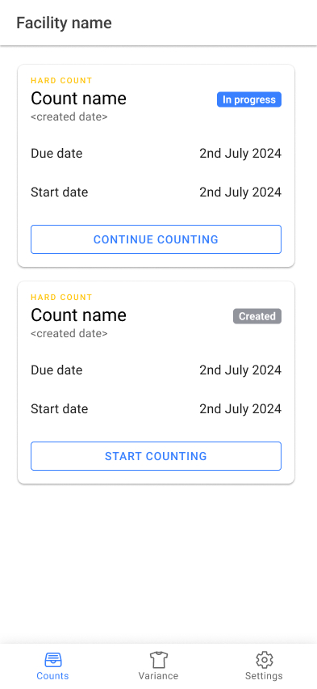
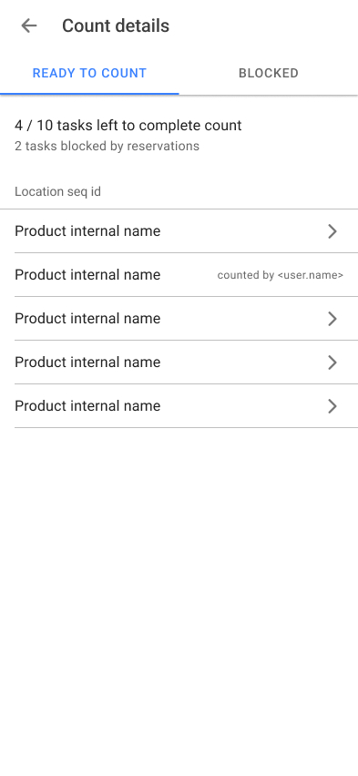
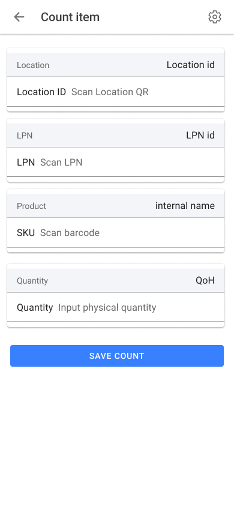
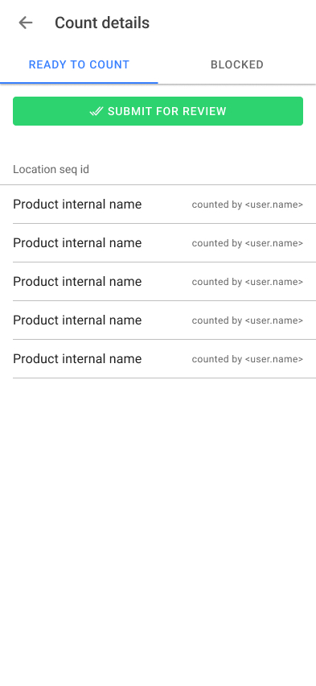

# Implementation plan

## Open cycle counts

List workEfforts where status is created or in progress.

If status is “in progress” then button label \= “continue counting” else “start counting”  
Clicking on button navigates to CountDetail page  
Due date \= Estimated completion date  
Start date \= Estimated start date  



## Count Details

Ready to count vs Blocked items:
An inventory item can only be counted when there are no active reservations assigned to it in the OISGIR table. While those reservations exist, the inventory count item will be considered "blocked" and is not ready to count.

For a given work effort:  
List items in “ready to count” where:

InventoryCountImport \+ InventoryCountImportItem

- Product+Facility+Location combined key  
  - Join to InventoryItem entity  
    - InventoryItem Id key  
      - Not In OrderItemShipGrpInvRes

For blocked items run the same query with “in” operator in OISGIR table

Once an item has been counted, do not allow others to edit that item. Show the count by name using userlogin.party.person.first name last name.

Here is a sample output of session items. When rendering the list, assume the server is returning a paginated list of the items sorted by the `locationSeqId.` The app needs to group the items by location seq id just so that they can be rendered into list groups correctly and each ion item divider shows the location seq id of the items below it.

Implement infinite scroll so that as the user scrolls they see new items.

```json
{
    "items": [
        {
            "workEffortId": "10320",
            "facilityId": "SLC",
            "uploadedByUserLogin": "hotwax.user",
            "quantity": null,
            "productId": "10001",
            "productIdentifier": null,
            "workEffortPurposeTypeId": "DIRECTED_COUNT",
            "countImportName": "Weekly store audit",
            "systemQuantity": null,
            "importItemSeqId": "00001",
            "lotId": null,
            "proposedVariance": 0.000000,
            "uuid": "1797ff52-31be-4386-ad0e-5af3cbb281ad",
            "workEffortName": "Weekly store audit",
            "itemStatusId": null,
            "createdAt": 1767688310265,
            "lotIdentifier": null,
            "workEffortStatusId": "CYCLE_CNT_IN_PRGS",
            "countImportStatusId": "SESSION_CREATED",
            "inventoryCountImportId": "10000",
            "isRequested": null,
            "locationSeqId": "CRP-1-1-1A",
            "countedByUserLogin": null
        },
        {
            "workEffortId": "10320",
            "facilityId": "SLC",
            "uploadedByUserLogin": "hotwax.user",
            "quantity": null,
            "productId": "10002",
            "productIdentifier": null,
            "workEffortPurposeTypeId": "DIRECTED_COUNT",
            "countImportName": "Weekly store audit",
            "systemQuantity": null,
            "importItemSeqId": "00002",
            "lotId": null,
            "proposedVariance": 0.000000,
            "uuid": "6aa8a8b0-8538-4853-9312-2a26ae6145d2",
            "workEffortName": "Weekly store audit",
            "itemStatusId": null,
            "createdAt": 1767688310270,
            "lotIdentifier": null,
            "workEffortStatusId": "CYCLE_CNT_IN_PRGS",
            "countImportStatusId": "SESSION_CREATED",
            "inventoryCountImportId": "10000",
            "isRequested": null,
            "locationSeqId": "CRP-1-1-1A",
            "countedByUserLogin": null
        },

```
    ]
}



## Count Item Details

On loading count item detail page, fetch:

1. LPN Controlled: Y/N  
   1. InventoryCountImport \+ Inventory Count Import Item  
      1. Facility Location  
         1. LPN Controlled: Y/N  
2. Container Id  
   1. ProductFacilityLocation \-\> InventoryItem.containerId  
3. Location Id  
   1. InventoryCountImportItem.LocationSeqId  
4. Product Id  
   1. InventoryCountImportItem.ProductId \-\> Product Store GoodIdentification preference

Logic:  
If LPN Controlled \= Y then show LPN Card  
	Else Show product scanning card  
On “save count” update inventory count import item



## Ready to submit

Once all items have a counted value, the progress bar at the top turns to “Submit for review” button that changes the session and work effort status



## Session lock

The cycle count app used to use a session lock to prevent multiple users from editing the same item. This is no longer needed as the app no longer uses a session lock. Users are counting one item at a time and they can only select items that are not already being counted by another user.

Because session lock is no longer used, the app no longer needs to create a session lock, check if a session is available, or release a session lock. Instead, the status of a session has been removed entirely from the user interface. and instead the app will manage this logic itself to service api requirments to the server.

How this works:

1. Work effort is created with status "created" and session status "session created"
2. When user starts counting, the work effort status is changed to "in progress" and session status is changed to "in progress"
3. When user completes counting and clicks submit for review, the work effort status is changed to "completed" and session status is changed to "completed".

This means all logic to aquire a session lock, check if a session is available, or release a session lock is no longer needed. and should be removed from the count detail and count item detail pages.


## Scan event parsing

A new wrapper function needs to be created that calls the create scan event function and then right after calls the update inventory count import item function. This should allow the session count detail page to call the next pending count item as soon as the user saves a count.

Without this wrapper function, the session count detail page will need to wait for the update inventory count import item function to complete which currently runs as a background service worker every 10 seconds. This will cause a delay in the user experience as the user will have to wait for the update inventory count import item function to complete before they can see the next pending count item.